# How to Backup & Restore the Boat's Network Equipment #
---
## TP-Link AC1750 ##
1. Select the "**Advanced**" tab at the top of the router management portal (located at [10.19.122.1](http://10.19.122.1) if the router was configured using the files in this directory, or [192.168.0.1](http://192.168.0.1) if the router has since been reset).
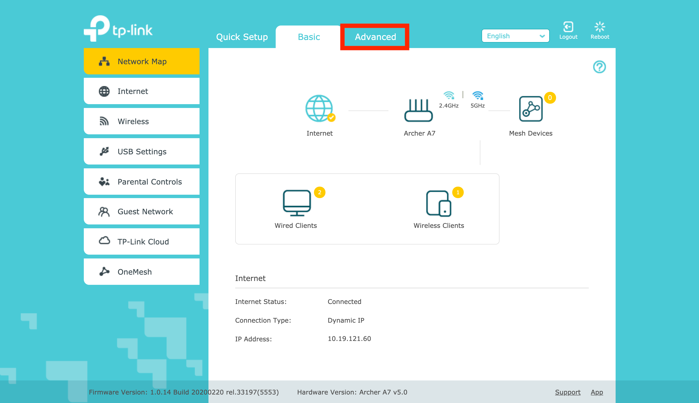

1. Select the "**System Tools**" option from page categories listed on the left of the management portal.
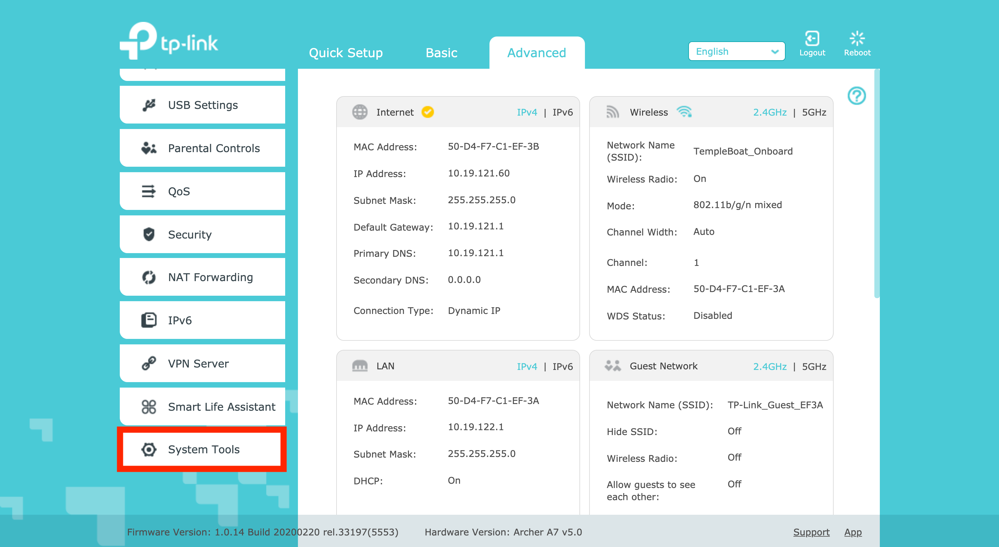

1. Select the "**Backup & Restore**" page from the drop-down menu that appeared after clicking "**System Tools**" in step 2.
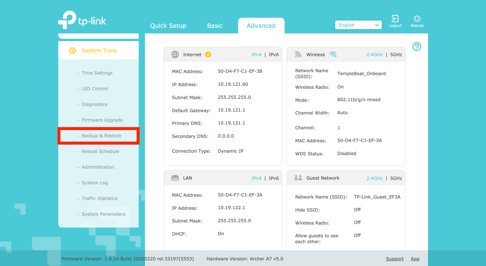

1. Here you can either (i) backup the current configuration, or (ii) restore to a previously backed-up configuration.
  1. Click the "**Backup**" button to generate a new backup that you are able to save on your local machine.
  1. Under the "**Restore**" section of the page, click the "**Browse**" button and locate the previously generated backup file on your local machine. Next, click the "**Restore**" button to complete the router restore process.

  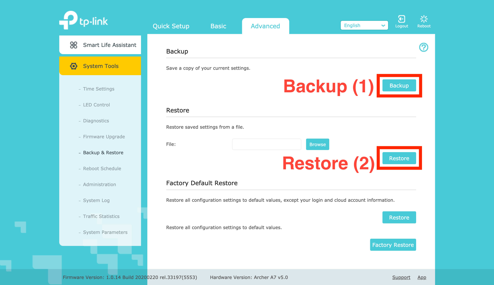

---
## TP-Link AC1200 ##

***NOTE: If this router is configured with the WDS and has its DHCP server disabled, you will not be able to directly access the management console by connecting to the network. Instead you will have to edit your computer's network settings. See [Modifying_Wifi_Bridge.md](../Modifying_WiFi_Bridge.md) for instructions on this procedure.***

1. Expand the "**System Tools**" menu in the router's management portal located at [10.19.123.1](http://10.19.123.1) if the router was configured using the files in this directory, or [192.168.0.1](http://192.168.0.1) if the router has since been reset.
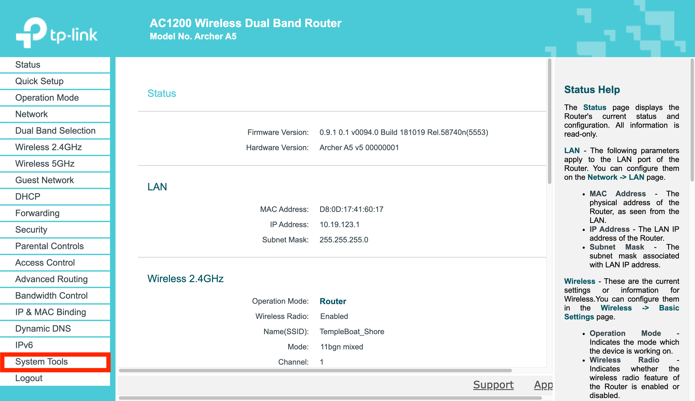

1. Select the "**Backup & Restore**" option from the expanded menu.
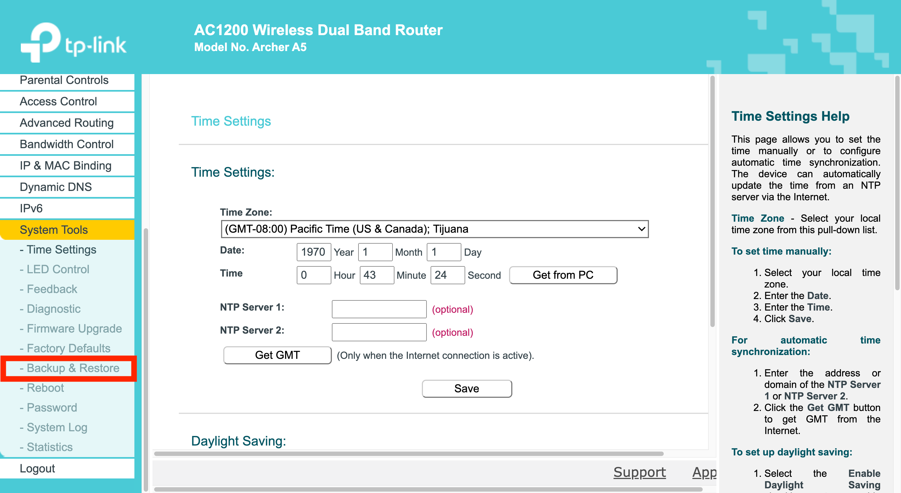

1.  Here you can either (i) backup the current configuration, or (ii) restore to a previously backed-up configuration.
  1. Click the "**Backup**" button to generate a new backup that you are able to save on your local machine.
  1.Click the "**Restore**" button and locate the previously generated backup file on your local machine. Next, click the "**Restore**" button to complete the router restore process.  

  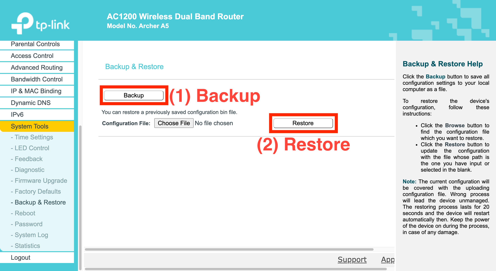

---
## GL.iNet GL-AR750 ##

1. Select the "**MORE SETTINGS**" drop-down menu on the left side of the router management portal (located at [10.19.121.1](http://10.19.121.1) if the router was configured using the files in this directory, or [192.168.8.1](http://192.168.8.1) if the router has since been reset).

1. Select "**Advanced**" from the drop-down menu.
  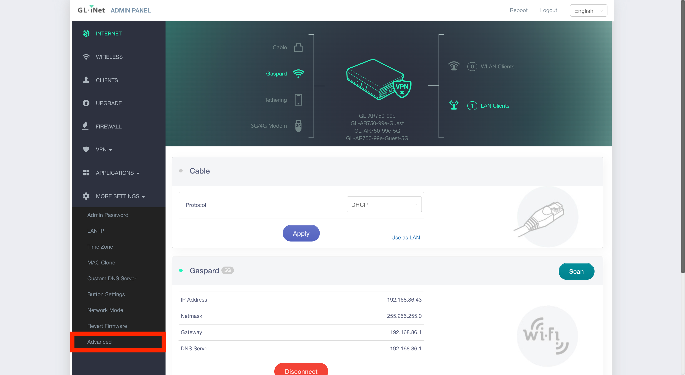

1. A new tab will open and present the login screen for the Open-WRT settings management portal. Login to the `root` account with the same password that you use to login to the router's main admin portal.
  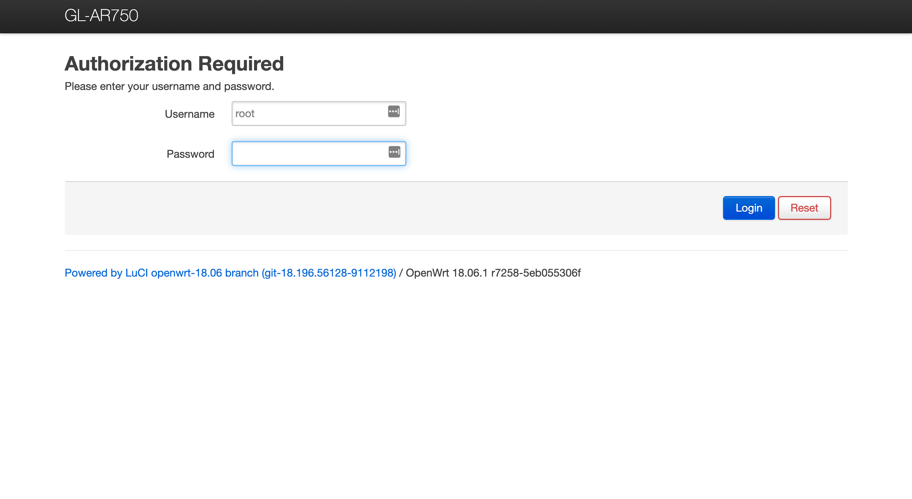

1. Hover over the "**System**" drop-down menu and click the "**Backup / Flash Firmware**" option from the list.
  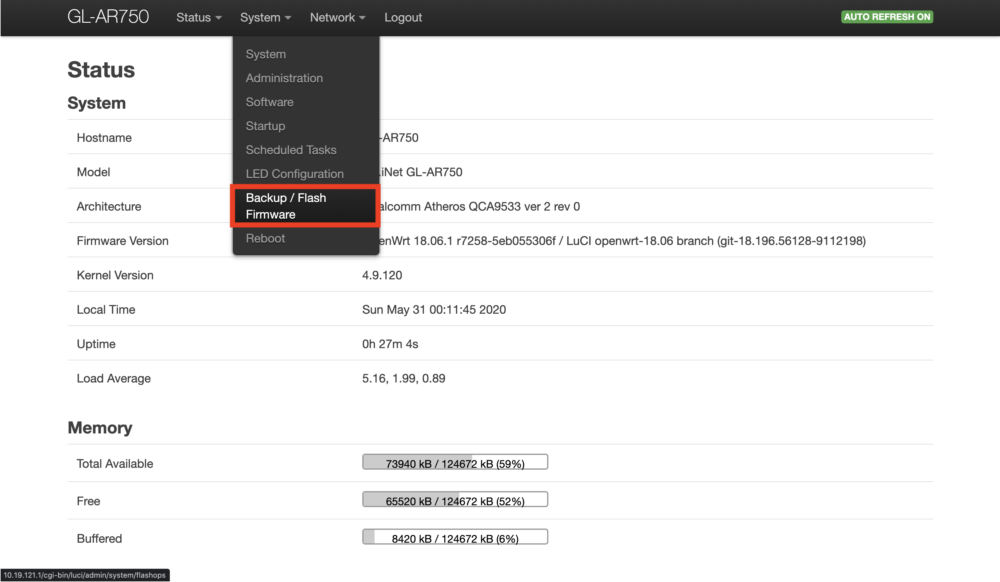

1. Here you can either (i) backup the current configuration, or (ii) restore to a previously backed-up configuration.
    1. Under the "**Backup**" section of the page, click the "**Generate archive**" button. A new backup will be made that you are able to save on your local machine.
    1. Under the "**Restore**" section of the page, click the "**Choose file**" button and upload the archive file that you wish to restore the router to. Next, click the "**Upload archive...**" button to complete the router restore process.

  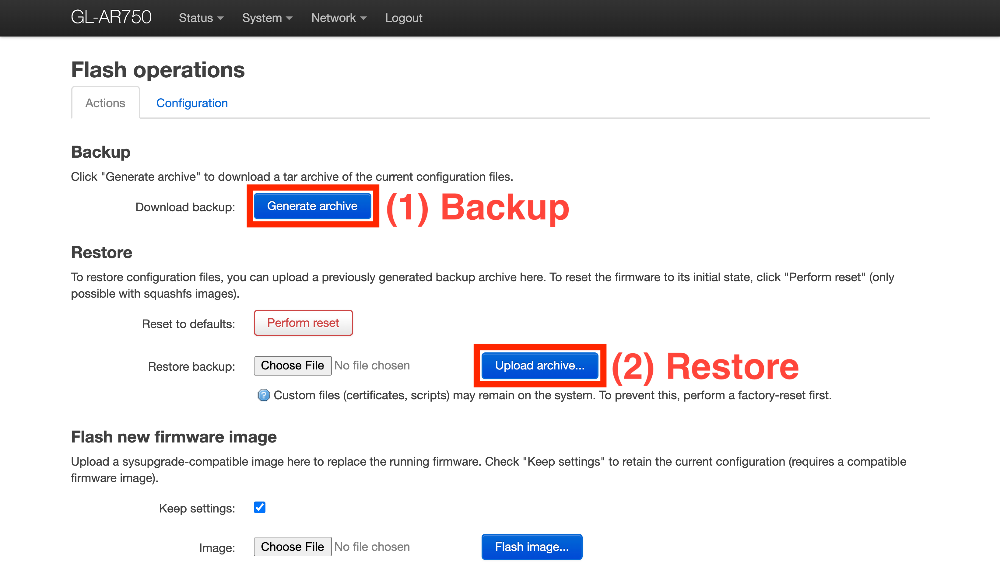
