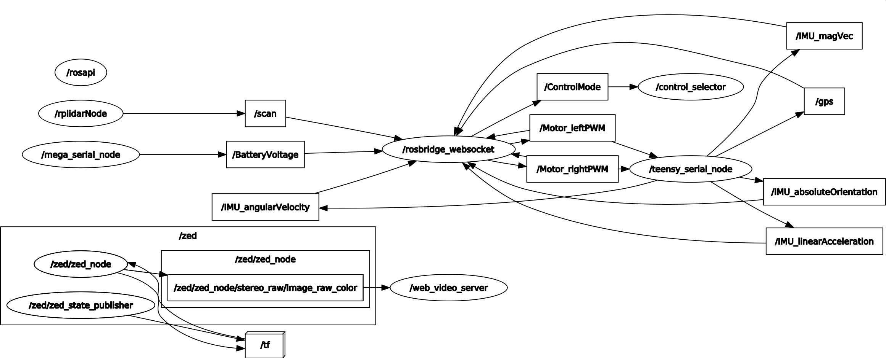

# ROS Packages #

## ROS Packages In Use ##
1. [zed-ros-wrapper](http://wiki.ros.org/zed-ros-wrapper) - Used to interface with the ZED stereo camera through ROS
1. [rplidar](http://wiki.ros.org/rplidar) - Used to interface with the RPLIDAR A3 through ROS
1. [rosserial](http://wiki.ros.org/rosserial) - Used to interface with the Teensy3.2 (for IMU, GPS, and motor control) and the Arduino MEGA2560 (for battery monitoring) through ROS
1. [rosserial_arduino](http://wiki.ros.org/rosserial_arduino) - Used to create the Arduino libraries on the Teensy3.2 an Arduino MEGA2560 for interfacing with the ROS network
1. [rospy](http://wiki.ros.org/rospy) - Used to create the ROS Python node for controlling the status indicator lights and starting/stopping autonomous routines
1. [rosbridge_suite](http://wiki.ros.org/rosbridge_suite) - Used to create a web interface for the ROS network for controlling and monitoring the boat
1. [web_video_server](http://wiki.ros.org/web_video_server) - Used to stream the camera feed from the ZED stereo camera to the website directly from the TX2

## Custom ROS Packages ##
1. [roboboat_control_status](roboboat_control_status/) - A ROS Python node that subscribes to the */ControlMode* topic to update the status light and to start/stop autonomous routines. The */ControlMode* message is an integer that corresponds to a specific operational mode. A message of 0 indicates manual control mode. A message of any other value indicates a specific autonomous routine. The status light mode is controlled with a GPIO pin and the [RPi.GPIO](https://pypi.org/project/RPi.GPIO/) library is used to control the RPi 4's GPIO signal for this purpose.
1. [roboboat_rosserial](roboboat_rosserial/) - The generic *rosserial* Python script provided in the package was modified to create two new python scripts. This was done as the ROS network has two *rosserial* nodes and using the default *rosserial* Python script would have resulted in errors as two nodes with the same name would be created. The names of *teensy_serial_node* and *mega_serial_node* were used in the two new python scripts and the serial ports that these devices are connected to were also checked/updated in the python script.
